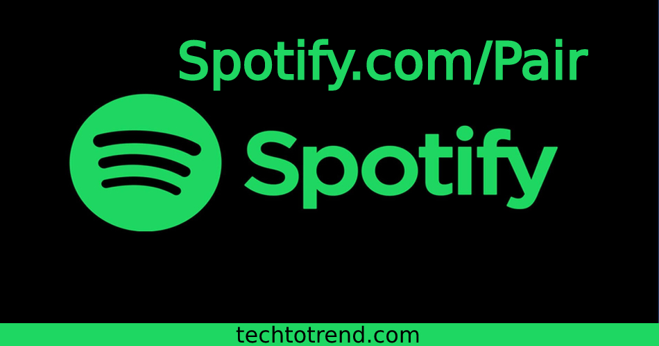

# Spotify.com/pair

**Spotify.com/pair** is a free music listening platform where you will get the music and songs of your favourite singer. Spotify comes with a dual version, i.e. the free and the paid. The free version runs ads in between every music or song. But by using Spotify premium, you can listen to music without interruption. Also, the main exciting thing is that you can even pair your smart devices to the Spotify account. Now go to Spotify's official site and create a Spotify account. The activation or pairing steps for your android tv are provided below.

## Pair Spotify to your Smart tv using spotify.com/pair:
Here is the two-step process of getting Spotify on your smart tv. But before proceeding, just get subscribe account to Spotify and then go through the process provided;

### Installing Spotify on your smart tv:
Turn on your smart tv and then follow the steps provided below;
1. Go to the application store of your smart tv.
2. If it's an Android tv, go to google play and for apple tv, go to the apple application store.
3. Then search for the **Spotify application**.
4. As soon as you go for the Spotify search, it will appear in front of you.
5. Now read out the app details and then go for its installation.
6. For Android, the tv goes for the install button, and for apple tv goes for the get button.
7. Now, wait until the Spotify application downloads
8. Then open the Spotify application.
9. Now, wait for the sign-in button to appear.
10. Click on the sign-in button.
11. Then after some seconds, the pairing code, i.e. the activation code, will appear on the Spotify application.

### Activate the Spotify.com/pair account on your smart tv:
Once you are with the Spotify activation code, take another device, such as a mobile phone or a Pc, and then go through these steps;
1. First, open the web browser on your Spotify application.
2. Then go to spotify.com/pair link using its search engine.
3. Here first, it will ask you for the activation code.
4. Enter the activation code as displayed on your tv screen.
5. Then it will ask you for the login credentials for your Spotify account.
6. Enter the activation code and then go to the login button.
7. Then watch out for your tv screen.
8. It will now show you the latest music shows playing on it.
9. This is all about the Spotify account activation on your smart tv.

## How to create an account on Spotify and then subscribe to it?
To create a subscribed account for Spotify, follow these simple steps;
1. Get any device and then open a web browser on it.
2. Then go to spotify.com using the web browser.
3. Here you get three options to sign up.
4. The Google, Facebook, and ordinary Spotify sign-up process.
5. Enter the email address, confirm the email address, create a password, enter your Date of Birth, and select gender.
6. Then go through the verification process and then press the sign-up button.
7. Now on the next page, you will get the account created.
8. Go to the upgrade button located in the upper right corner.
9. Scroll down and see the Spotify plans.
10. Select the plan and then select the duration for that plan.
11. Also, choose the payment method and then go for the payment.
12. In this way, you have subscribed to **Spotify premium**.
13. Now you can listen to music without any additional interruption and also can create your playlist.

## FAQ:

### What is the Spotify activation code?
Ans: Spotify activation code is a 6-digit activation code that displays on your tv or any smart device screen. Using this code, you can activate your **Spotify account** on any device. But to use the activation code, you will need a smartphone or a PC. 

### Which devices support the Spotify application?
Ans: Following are the devices that do support the Spotify application;
1. Android Smart tv.
2. Apple Tv.
3. LG smart tv.
4. Roku smart device.
5. Telstra tv.
6. Samsung Tv.
7. Amazon Fire tv or Firestick.
8. Windows Pc.
9. MacBook.
10. iOS devise, i.e. iPhone or iPad.
11. Android smartphone.
12. And other smart devices.

### Can I renew the Spotify premium plan?
Ans: Yes, you can renew your **Spotify premium** plan or subscription. You need to enter your card details, select the premium plan and then go for the renewal. 
